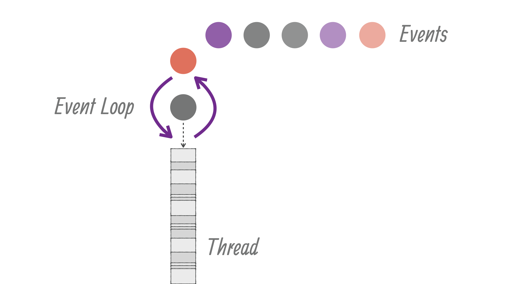
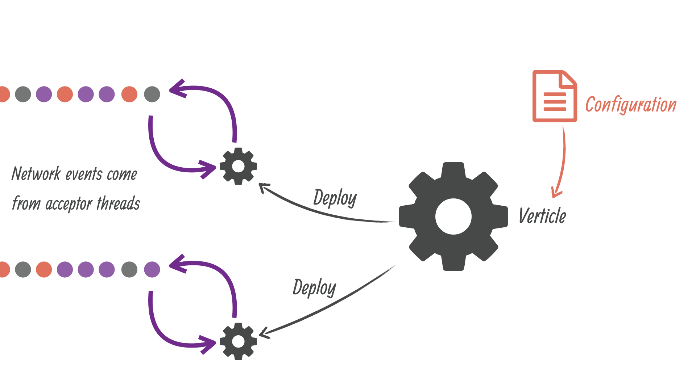
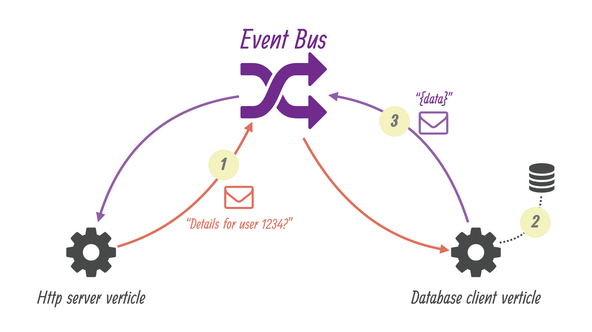

# Java开发者使用 Eclipse Vert.x 进行异步编程的简要指南

*致谢*
 
本文档收到了来自 Arnaud Esteve，Marc Paquette，Ashley Bye，Ger-Jan te Dorsthorst，Htet Aung Shine 等人的贡献。

## 引言

本指南简要介绍了 Vert.x 的异步编程，主要针对熟悉主流非异步Web开发框架和库（例如 Java EE，Spring）的开发者。

### 关于本指南

我们假设读者熟悉 Java 编程语言及其生态系统。

我们将从一个由关系数据库和服务器端页面渲染支持的 wiki Web 应用程序开始；然后我们将通过几个步骤改进应用程序，直到它成为具有"实时"功能的现代单页面应用。在此过程中，您将学习：

1. 设计一个 Web 应用程序，通过模板在服务器端渲染页面，并使用关系数据库来持久化数据。
2. 将每个技术组件清晰地隔离为可重用的事件处理单元，称之为 ***Verticle***。
3. 提取 Vert.x 服务，以便于设计在同一JVM进程内或集群中的分布式节点之间无缝地相互通信的 Verticle。
4. 使用异步操作测试代码。
5. 与公开 Http/JSON web API 的第三方服务进行集成。
6. 公开 Http/JSON web API
7. 使用 HTTPS，Web 浏览器会话的用户身份验证和第三方客户端应用程序的JWT令牌保护和控制访问。
8. 重构一些代码以使用流行的 RxJava 库与 Vert.x 集成进行响应式编程
9. 使用 AngularJS 进行单页面应用程序的客户端编程。
10. 通过 SockJS 集成的统一的 Vert.x 事件总线进行实时 Web 编程。

**NOTE**
> 本文档和代码示例的源码可从[https://github.com/vert-x3/vertx-guide-for-java-devs](https://github.com/vert-x3/vertx-guide-for-java-devs)获得。我们欢迎问题报告，反馈和pull请求！

### 什么是 Vert.x?

> Eclipse Vert.x 是一个用于在 JVM 上构建响应式应用程序的工具包。
> 
> — Vert.x website

Eclipse Vert.x（我们在本文档的后面部分将简称为 Vert.x）是 Eclipse Foundation 的一个开源项目。Vert.x 由 Tim Fox 于2012年发起。

Vert.x 不是框架而是工具包：核心库定义了编写异步网络应用程序的基本API，然后您可以为应用程序选择有用的模块（例如，数据库连接，监视，身份验证，日志记录，服务发现，集群支持等）。 Vert.x 基于 Netty 项目，这是一个用于JVM的高性能异步网络库。如果需要，Vert.x将允许您访问 Netty 内部，但通常您将从 Vert.x 提供的更高级别的API中受益，同时与使用原生的 Netty 相比不会牺牲性能。

由于 Vert.x 是为异步通信而设计的，因此它可以处理更多的并发网络连接，而且只需要比 Java servlet 或 java.net 套接字类等同步API更少的线程。Vert.x 适用于大量的应用程序：高容量消息/事件处理，微服务，API网关，移动应用程序的HTTP API等。 Vert.x 及其生态系统提供各种技术工具，用于构建端对端的响应应用程序。

虽然听起来 Vert.x 仅对要求苛刻的应用程序有用，但本指南同样认为 Vert.x 适用于更传统的Web应用程序。正如我们将要看到的，代码仍然是相对容易理解的，但如果应用程序需要面对突然的流量高峰，代码已经准备好了用与扩展的基础部分，那就是 *异步处理事件*。

最后，值得一提的是 Vert.x 是多语言，它支持各种流行的JVM语言：Java，Groovy，Scala，Kotlin，JavaScript，Ruby和Ceylon。在 Vert.x 中支持一种语言的目标不仅仅是提供对API的访问，同时还要确保该语言的API在每种目标语言中都是通用的（例如，使用 Scala 的 futures 代替 Vert.x 的 futures）。使用不同的JVM语言开发 Vert.x 应用程序的不同技术部分是很可行的。

### Vert.x 核心概念

在Vert.x中有两个要学习的关键概念：

1. 什么是Verticle
2. 事件总线如何让Verticle进行通信。

#### 线程和编程模型

许多网络库和框架依赖于简单的线程策略：每个网络客户端在连接时被分配一个线程，然后该线程处理这个客户端直到断开连接。使用 Servlet 或 java.io 和 java.net 包编写的网络代码就是这种情况。虽然这种“同步 I/O”线程模型具有易于理解的优点，但由于系统线程开销并不小，它会因太多并发连接而影响可伸缩性，并且在负载很重的情况下，操作系统内核将在线程调度管理上花费大量时间。在这种情况下，Vert.x为我们需要转向“异步 I/O”提供了坚实的基础。

Vert.x中的调度单元被称为 *Verticle*。Verticle 通过事件循环处理传入事件，其中事件可以是接收网络缓冲区，定时事件或其他 verticle 发送的消息之类的任何东西。事件循环在异步编程模型中是很典型的：

每个事件都应该在合理的时间内被处理，以避免阻塞事件循环在。这意味着在事件循环在中时不应该执行线程阻塞操作，就像处理 GUI 中的事件一样（例如，因为网络请求低速冻结 Java / Swing 接口）。正如稍后我们将在本指南看到的，Vert.x 提供了在事件循环在之外的处理阻塞操作的机制。在任何情况下，当事件循环在处理一个事件太长时，Vert.x 将会在日志中发出警告，这也是可配置的，来满足特定的应用程序的要求（例如，在较慢的 IoT ARM 板上工作时）。

每个事件循环都附加到一个线程。默认情况下，Vert.x 为每个CPU核心线程附加2个事件循环。直接结果是一个常规的 verticle 总是处理同一线程上的事件，因此不需要使用线程协调机制来控制 verticle的状态（例如，Java class fields）。

可以通过一些选项（例如，凭证，网络地址等）配置 verticle，并且一个 verticle 可以多次部署：

传入的网络数据被接受线程接收，然后被作为事件传递给相应的 verticle。当 verticle 打开网络服务器并且被多次部署时，事件将以轮询的方式分发到 verticle 实例，这对于在大量并发网络请求的情况下最大化CPU使用率非常有用。最后，verticle 具有简单的开始/结束生命周期，verticle 可以部署其他的 verticle。

#### 事件总线

Verticle构成了 Vert.x 中代码部署的技术单元。Vert.x 事件总线是不同 verticle 通过异步传递消息进行通信的主要工具。例如，假设我们有一个用于处理 HTTP 请求的verticle，以及一个用于管理对数据库的访问的 verticle。事件总线允许 HTTP verticle向执行 SQL 查询的数据库 verticle 发送请求，并对 HTTP verticle作出响应：

事件总线允许传递任何类型的数据，尽管 JSON 是首选的交换格式，因为它允许以不同语言编写的 verticle 进行通信，更通俗地说，JSON 是一种流行的通用半结构化数据交换文本格式。

消息可以发送到自由格式字符串的目的地。事件总线支持以下通信模式：

1. 点对点消息
2. 请求-响应消息
3. 发布/订阅广播消息。

事件总线允许Verticle不仅在同一JVM进程内透明地进行通信：

- 当网络集群被激活时，事件总线是分布式的，这样消息便可以被发送到在其他应用程序节点上运行的 verticle
- 可以通过简单的 TCP 协议访问事件总线，以便与第三方应用程序进行通信
- 事件总线也可以通过通用的消息桥接器（例如，AMQP，Stomp）暴露
- 通过浏览器上运行的JavaScript中的事件总线，SockJS 桥接器允许 Web 应用程序通过接收和发布消息无缝地进行通信，就像其他 verticle 一样。
