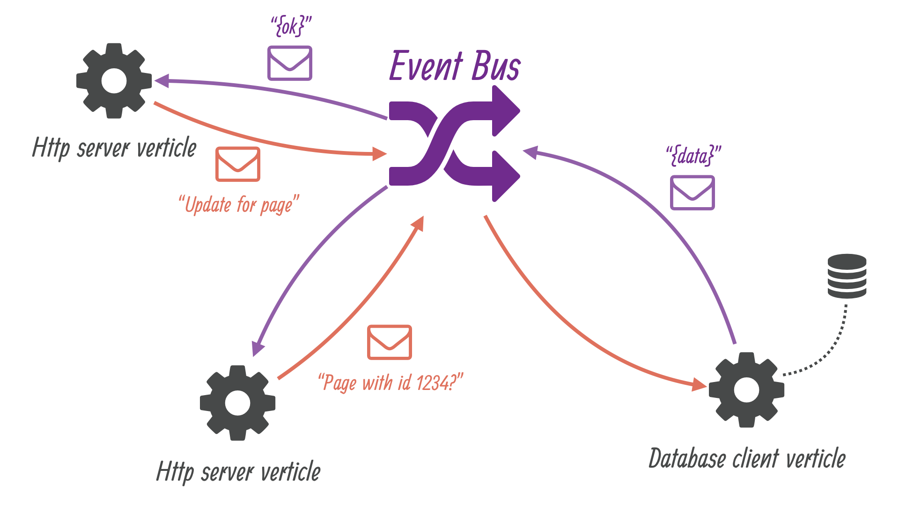

## 重构为独立的，可复用的 verticles

**TIP**
>相应的源码位于本指南仓库的`step-2`文件夹中

第一次迭代为我们提供了一个可以工作的 wiki 应用。但是，它的实现还存在以下问题：
 
1. HTTP 请求的处理和数据库的访问，这些代码在同一个方法中互相交织。
2. 许多配置数据（例如，端口号，JDBC 驱动程序等）在代码中硬编码。

### 架构和技术选择

第二次迭代将把代码重构为独立且可重用的 verticle：

我们将部署2个 verticle 来处理 HTTP 请求，1个 verticle 用于封装数据库持久化。生成的 verticles 不会直接互相引用，它们只会商定事件总线中的目标名称以及消息格式。这提供了简单而有效的解耦。

在事件总线上发送的消息将以 JSON 编码。虽然 Vert.x 在事件总线上支持灵活的序列化方案，来满足要求严格的或高度定制的上下文，但使用 JSON 数据通常是明智的选择。使用 JSON 的另一个好处是它是一种与编程语言无关的文本格式。由于 Vert.x 是多语言的，如果用不同语言编写的 verticle 需要通过消息传递进行通信，那么 JSON 是理想的选择。

### HTTP 服务器  verticle

	verticle 类开头样板代码和`start`方法如下所示：
	
	public class HttpServerVerticle extends AbstractVerticle {
	
	  private static final Logger LOGGER = LoggerFactory.getLogger(HttpServerVerticle.class);
	
	  public static final String CONFIG_HTTP_SERVER_PORT = "http.server.port";  (1)
	  public static final String CONFIG_WIKIDB_QUEUE = "wikidb.queue";
	
	  private String wikiDbQueue = "wikidb.queue";
	
	  @Override
	  public void start(Future<Void> startFuture) throws Exception {
	
	    wikiDbQueue = config().getString(CONFIG_WIKIDB_QUEUE, "wikidb.queue");  (2)
	
	    HttpServer server = vertx.createHttpServer();
	
	    Router router = Router.router(vertx);
	    router.get("/").handler(this::indexHandler);
	    router.get("/wiki/:page").handler(this::pageRenderingHandler);
	    router.post().handler(BodyHandler.create());
	    router.post("/save").handler(this::pageUpdateHandler);
	    router.post("/create").handler(this::pageCreateHandler);
	    router.post("/delete").handler(this::pageDeletionHandler);
	
	    int portNumber = config().getInteger(CONFIG_HTTP_SERVER_PORT, 8080);  (3)
	    server
	      .requestHandler(router::accept)
	      .listen(portNumber, ar -> {
	        if (ar.succeeded()) {
	          LOGGER.info("HTTP server running on port " + portNumber);
	          startFuture.complete();
	        } else {
	          LOGGER.error("Could not start a HTTP server", ar.cause());
	          startFuture.fail(ar.cause());
	        }
	      });
	  }
	
	  // (...)

1. 我们公开了 verticle 配置参数的 public 常量：HTTP 端口号和事件总线目的地的名称，以便将消息发布到数据库 verticle。
2. `AbstractVerticle＃config()`方法允许访问已提供的 verticle 配置。第二个参数是在没有找到指定配置的值时的默认值。
3. 配置的值不仅可以是`String`对象，还可以是整数，布尔值，复杂 JSON 数据等。

这个类的其余部分主要是把 HTTP 部分的代码提取出来，之前的数据库代码被事件总线消息替换。这是`indexHandler`方法代码：

	private final FreeMarkerTemplateEngine templateEngine = FreeMarkerTemplateEngine.create();
	
	private void indexHandler(RoutingContext context) {
	
	  DeliveryOptions options = new DeliveryOptions().addHeader("action", "all-pages"); (2)
	
	  vertx.eventBus().send(wikiDbQueue, new JsonObject(), options, reply -> {  (1)
	    if (reply.succeeded()) {
	      JsonObject body = (JsonObject) reply.result().body();   (3)
	      context.put("title", "Wiki home");
	      context.put("pages", body.getJsonArray("pages").getList());
	      templateEngine.render(context, "templates", "/index.ftl", ar -> {
	        if (ar.succeeded()) {
	          context.response().putHeader("Content-Type", "text/html");
	          context.response().end(ar.result());
	        } else {
	          context.fail(ar.cause());
	        }
	      });
	    } else {
	      context.fail(reply.cause());
	    }
	  });
	}

1. vertx对象提供对事件总线的访问，我们向数据库 verticle 的队列发送消息。
2. Delivery options允许我们指定头部，负载编解码器和超时设置。
3. 成功后，回复包含有效负载。