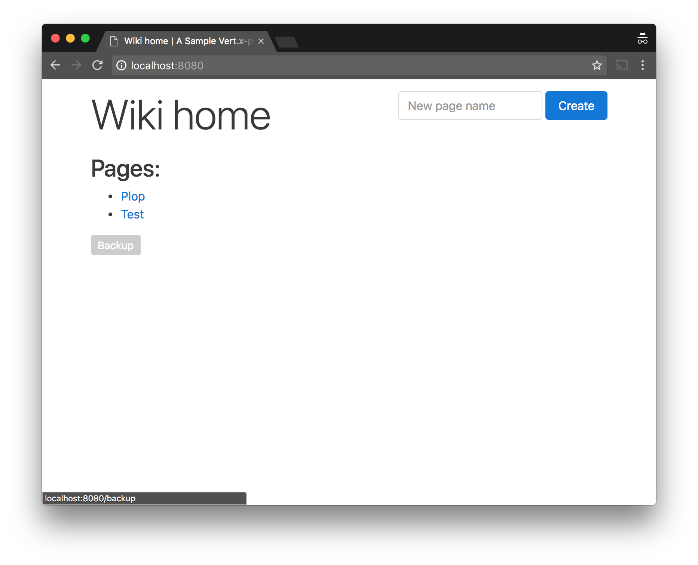
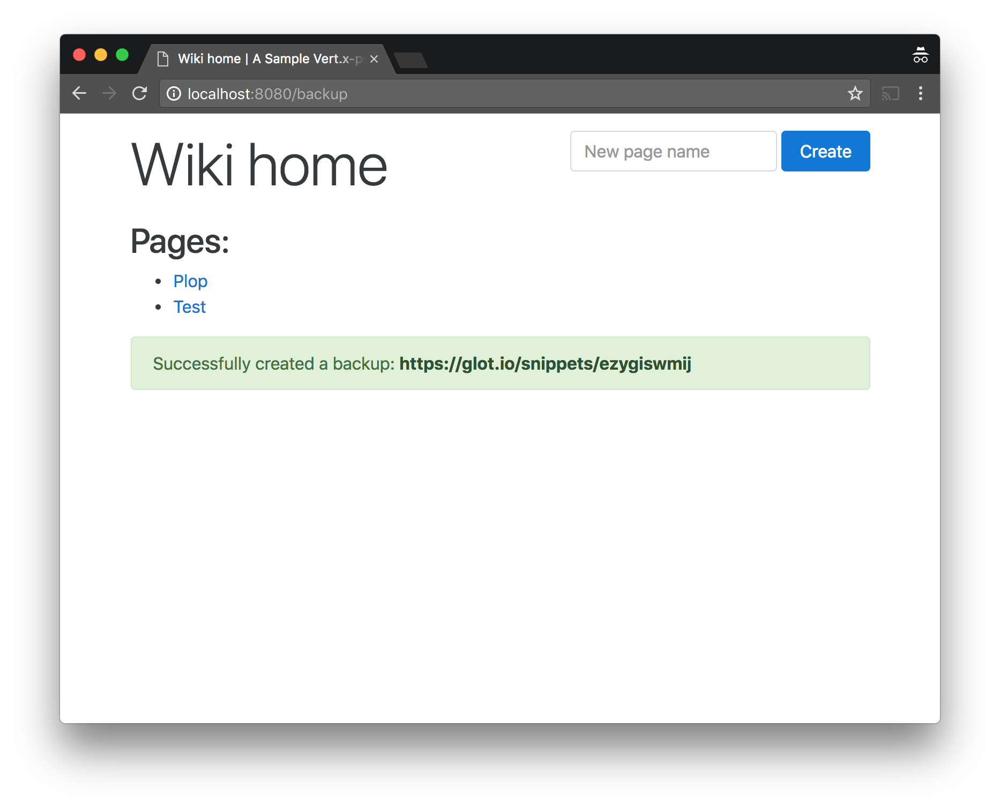
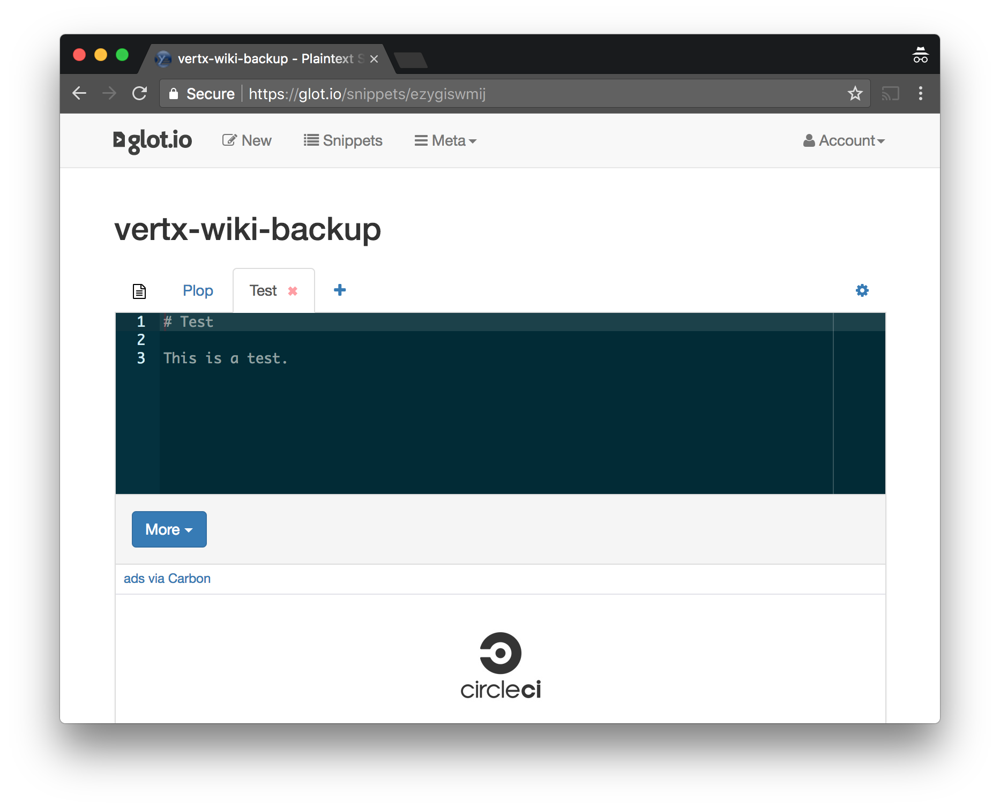

## 与第三方 web 服务集成

**TIP**
>相应的源代码位于指南库的step-5文件夹中。

现代应用程序很少存在于一个孤岛上，它们需要与其他（分布式）应用程序和服务集成。通常使用通过通用 HTTP 协议公开的API实现集成。

本节介绍如何使用 Vert.x 的 HTTP 客户端 API 与第三方 Web 服务集成。

### 场景：备份到 Glot.io

[Glot服务](https://glot.io)允许向世界共享代码片段和文件。它公开了一个用于发布匿名片段的 API。

我们将利用此服将我们的 wiki 页面备份为片段，每个文件代表一个 Wiki 页面的 Markdown 内容。

将在 Wiki 索引页面上添加一个新按钮：

单击*backup* 按钮将触发创建代码段：

然后可以在 Glot.io 上看到每个备份片段：

### 更新数据库服务

在我们深入了解 Web 客户端 API 并对另一个服务执行 HTTP 请求之前，我们需要更新数据库服务的 API，来一次性获取所有 Wiki 页面数据。这对应的要添加以下 SQL 查询到`db-queries.properties`：
	
	all-pages-data=select * from Pages

`WikiDatabaseService`接口中添加了一个新方法：

	@Fluent
	WikiDatabaseService fetchAllPagesData(Handler<AsyncResult<List<JsonObject>>> resultHandler);

`WikiDatabaseServiceImpl`中的实现如下：

	@Override
	public WikiDatabaseService fetchAllPagesData(Handler<AsyncResult<List<JsonObject>>> resultHandler) {
	  dbClient.query(sqlQueries.get(SqlQuery.ALL_PAGES_DATA), queryResult -> {
	    if (queryResult.succeeded()) {
	      resultHandler.handle(Future.succeededFuture(queryResult.result().getRows()));
	    } else {
	      LOGGER.error("Database query error", queryResult.cause());
	      resultHandler.handle(Future.failedFuture(queryResult.cause()));
	    }
	  });
	  return this;
	}

### Web 客户端 API

Vert.x 核心库的`vertx`上下文对象提供`createHttpClient`方法。`io.vertx.core.http.HttpClient`的实例提供了用于执行各种 HTTP 请求的低级方法，并对协议和事件流进行了细粒度控制。

Web 客户端 API 提供了更简单的门面，特别是简化有效负载数据的封装和解封。此 API 以新依赖项的形式出现：

	<dependency>
	  <groupId>io.vertx</groupId>
	  <artifactId>vertx-web-client</artifactId>
	  <version>${vertx.version}</version>
	</dependency>

以下是单元测试的示例用法。测试启动了 HTTP 服务器，然后它使用 Web 客户端 API 执行 HTTP GET 请求，以检查对服务器的请求是否成功：

	@Test
	public void start_http_server(TestContext context) {
	  Async async = context.async();
	
	  vertx.createHttpServer().requestHandler(req ->
	    req.response().putHeader("Content-Type", "text/plain").end("Ok"))
	  .listen(8080, context.asyncAssertSuccess(server -> {
	
	    WebClient webClient = WebClient.create(vertx);
	
	      webClient.get(8080, "localhost", "/").send(ar -> {
	        if (ar.succeeded()) {
	          HttpResponse<Buffer> response = ar.result();
	          context.assertTrue(response.headers().contains("Content-Type"));
	          context.assertEquals("text/plain", response.getHeader("Content-Type"));
	          context.assertEquals("Ok", response.body().toString());
	          webClient.close();
	          async.complete();
	        } else {
	          async.resolve(Future.failedFuture(ar.cause()));
	        }
	      });
	    }));
	}

### 创建匿名片段

首先，我们需要一个 Web 客户端对象来向 Gist API 发出 HTTP 请求：

	webClient = WebClient.create(vertx, new WebClientOptions()
	  .setSsl(true)
	  .setUserAgent("vert-x3"));

**TIP**

>由于请求是使用 HTTPS 进行的，因此我们需要使用 SSL 支持来配置 web 客户端。
>我们使用 vert-x3 覆盖默认用户代理，但您可以选择使用自己的值。

然后，我们修改`HttpServerVerticle`类中的Web路由器配置，以添加用于触发备份的新路由：

	router.get("/backup").handler(this::backupHandler);

此 handler 的代码如下:

	private void backupHandler(RoutingContext context) {
	  dbService.fetchAllPagesData(reply -> {
	    if (reply.succeeded()) {
	
	      JsonArray filesObject = new JsonArray();
	      JsonObject payload = new JsonObject() (1)
	        .put("files", filesObject)
	        .put("language", "plaintext")
	        .put("title", "vertx-wiki-backup")
	        .put("public", true);
	
	      reply
	        .result()
	        .forEach(page -> {
	          JsonObject fileObject = new JsonObject(); (2)
	          fileObject.put("name", page.getString("NAME"));
	          fileObject.put("content", page.getString("CONTENT"));
	          filesObject.add(fileObject);
	        });
	
	      webClient.post(443, "snippets.glot.io", "/snippets") (3)
	        .putHeader("Content-Type", "application/json")
	        .as(BodyCodec.jsonObject()) (4)
	        .sendJsonObject(payload, ar -> {  (5)
	          if (ar.succeeded()) {
	            HttpResponse<JsonObject> response = ar.result();
	            if (response.statusCode() == 200) {
	              String url = "https://glot.io/snippets/" + response.body().getString("id");
	              context.put("backup_gist_url", url);  (6)
	              indexHandler(context);
	            } else {
	              StringBuilder message = new StringBuilder()
	                .append("Could not backup the wiki: ")
	                .append(response.statusMessage());
	              JsonObject body = response.body();
	              if (body != null) {
	                message.append(System.getProperty("line.separator"))
	                  .append(body.encodePrettily());
	              }
	              LOGGER.error(message.toString());
	              context.fail(502);
	            }
	          } else {
	            Throwable err = ar.cause();
	            LOGGER.error("HTTP Client error", err);
	            context.fail(err);
	          }
	      });
	
	    } else {
	      context.fail(reply.cause());
	    }
	  });
	}

1. 代码段创建请求的有效内容是[服务 API 文档](https://github.com/prasmussen/glot-snippets/blob/master/api_docs/create_snippet.md)中概述的 JSON 文档。
2. 每个文件都是负载中`file`对象下的一个条目，带有标题和内容。
3. web 客户端需要在端口 443（HTTPS）上发出`POST`请求，路径必须是`/snippets`。
4. `BodyCodec`类提供了帮助，用于指定将响应将直接转换为 Vert.x `JsonObject`实例。也可以使用`BodyCodec#json（Class <T>）`，JSON 数据将映射W为类型为`T`的 Java 对象（这使用了 Jackson 数据映射）。
5. `sendJsonObject`用来帮助触发带有 JSON 负载的 HTTP 请求。
6. 成功后，我们可以获取片段标识符(identifier)，并构建一个用户友好的 Web 表现的URL。