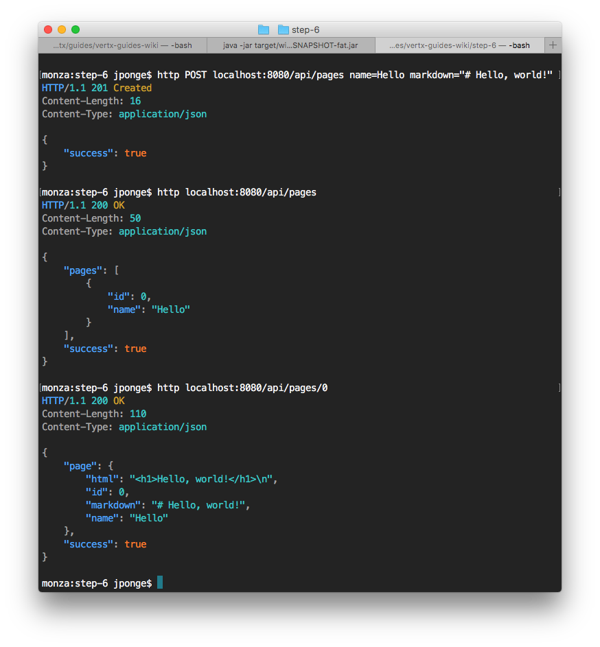

## 公开 web API

**TIP**
>相应的源代码位于指南库的`step-6`文件夹中。

使用我们已经在`vertx-web`模块中介绍的内容，公开 web HTTP/JSON API 非常简单。我们将使用以下 URL方案公开 web API：

1. `GET /api/pages` 返回包含所有 wiki 页面名称和标识符提供的文档
2. `POST /api/ages` 创建一个新的 wiki 页面的文档
3. `PUT /api/pages/:id` 更新 wiki 页面的文档
4. `DELETE /api/pages/:id` 删除一个 wiki 页面。

以下是使用 [HTTPie command-line tool](https://httpie.org/) 与 API 交互的屏幕截图：

### Web 子路由器

我们将向`HttpServerVerticle`添加新的路由处理器。虽然我们可以在现有路由器上添加处理程序，但我们也可以利用子路由器(*sub-routers*)。这允许将路由器安装为另一个路由器的子路由器，这对于组织 and/or 重用处理程序非常有用。

以下是 API 路由器的代码：

	Router apiRouter = Router.router(vertx);
	apiRouter.get("/pages").handler(this::apiRoot);
	apiRouter.get("/pages/:id").handler(this::apiGetPage);
	apiRouter.post().handler(BodyHandler.create());
	apiRouter.post("/pages").handler(this::apiCreatePage);
	apiRouter.put().handler(BodyHandler.create());
	apiRouter.put("/pages/:id").handler(this::apiUpdatePage);
	apiRouter.delete("/pages/:id").handler(this::apiDeletePage);
	router.mountSubRouter("/api", apiRouter); (1)

1. 这是我们安装路由器的地方，因此以`/api`开头的请求路径将被定向到`apiRouter`。

### 处理器

以下是不同的 API 路由器处理程序的代码。

#### 根资源

	private void apiRoot(RoutingContext context) {
	  dbService.fetchAllPagesData(reply -> {
	    JsonObject response = new JsonObject();
	    if (reply.succeeded()) {
	      List<JsonObject> pages = reply.result()
	        .stream()
	        .map(obj -> new JsonObject()
	          .put("id", obj.getInteger("ID"))  (1)
	          .put("name", obj.getString("NAME")))
	        .collect(Collectors.toList());
	      response
	        .put("success", true)
	        .put("pages", pages); (2)
	      context.response().setStatusCode(200);
	      context.response().putHeader("Content-Type", "application/json");
	      context.response().end(response.encode()); (3)
	    } else {
	      response
	        .put("success", false)
	        .put("error", reply.cause().getMessage());
	      context.response().setStatusCode(500);
	      context.response().putHeader("Content-Type", "application/json");
	      context.response().end(response.encode());
	    }
	  });
	}

1. 我们只是在页面信息的 entry 对象中重新映射了数据库的结果。
2. 生成的 JSON 数组将成为响应负载中`pages`键的值。
3. `JsonObject＃encode()`给出了 JSON 数据的紧凑字符串表示。

#### 获取页面

	private void apiGetPage(RoutingContext context) {
	  int id = Integer.valueOf(context.request().getParam("id"));
	  dbService.fetchPageById(id, reply -> {
	    JsonObject response = new JsonObject();
	    if (reply.succeeded()) {
	      JsonObject dbObject = reply.result();
	      if (dbObject.getBoolean("found")) {
	        JsonObject payload = new JsonObject()
	          .put("name", dbObject.getString("name"))
	          .put("id", dbObject.getInteger("id"))
	          .put("markdown", dbObject.getString("content"))
	          .put("html", Processor.process(dbObject.getString("content")));
	        response
	          .put("success", true)
	          .put("page", payload);
	        context.response().setStatusCode(200);
	      } else {
	        context.response().setStatusCode(404);
	        response
	          .put("success", false)
	          .put("error", "There is no page with ID " + id);
	      }
	    } else {
	      response
	        .put("success", false)
	        .put("error", reply.cause().getMessage());
	      context.response().setStatusCode(500);
	    }
	    context.response().putHeader("Content-Type", "application/json");
	    context.response().end(response.encode());
	  });
	}

#### 创建页面

	private void apiCreatePage(RoutingContext context) {
	  JsonObject page = context.getBodyAsJson();
	  if (!validateJsonPageDocument(context, page, "name", "markdown")) {
	    return;
	  }
	  dbService.createPage(page.getString("name"), page.getString("markdown"), reply -> {
	    if (reply.succeeded()) {
	      context.response().setStatusCode(201);
	      context.response().putHeader("Content-Type", "application/json");
	      context.response().end(new JsonObject().put("success", true).encode());
	    } else {
	      context.response().setStatusCode(500);
	      context.response().putHeader("Content-Type", "application/json");
	      context.response().end(new JsonObject()
	        .put("success", false)
	        .put("error", reply.cause().getMessage()).encode());
	    }
	  });
	}

这个处理程序和其他处理程序需要处理传入的 JSON 文档。下面的`validateJsonPageDocument`方法是用于帮助执行验证和进行初期错误报告的，因此其余的处理部分假定是存在这些 JSON 字段的：

	private boolean validateJsonPageDocument(RoutingContext context, JsonObject page, String... expectedKeys) {
	  if (!Arrays.stream(expectedKeys).allMatch(page::containsKey)) {
	    LOGGER.error("Bad page creation JSON payload: " + page.encodePrettily() + " from " + context.request().remoteAddress());
	    context.response().setStatusCode(400);
	    context.response().putHeader("Content-Type", "application/json");
	    context.response().end(new JsonObject()
	      .put("success", false)
	      .put("error", "Bad request payload").encode());
	    return false;
	  }
	  return true;
	}

#### 更新页面

	private void apiUpdatePage(RoutingContext context) {
	  int id = Integer.valueOf(context.request().getParam("id"));
	  JsonObject page = context.getBodyAsJson();
	  if (!validateJsonPageDocument(context, page, "markdown")) {
	    return;
	  }
	  dbService.savePage(id, page.getString("markdown"), reply -> {
	    handleSimpleDbReply(context, reply);
	  });
	}

`handleSimpleDbReply`方法是完结请求处理的工具：

	private void handleSimpleDbReply(RoutingContext context, AsyncResult<Void> reply) {
	  if (reply.succeeded()) {
	    context.response().setStatusCode(200);
	    context.response().putHeader("Content-Type", "application/json");
	    context.response().end(new JsonObject().put("success", true).encode());
	  } else {
	    context.response().setStatusCode(500);
	    context.response().putHeader("Content-Type", "application/json");
	    context.response().end(new JsonObject()
	      .put("success", false)
	      .put("error", reply.cause().getMessage()).encode());
	  }
	}

#### 删除页面

	private void apiDeletePage(RoutingContext context) {
	  int id = Integer.valueOf(context.request().getParam("id"));
	  dbService.deletePage(id, reply -> {
	    handleSimpleDbReply(context, reply);
	  });
	}

### API 单元测试

我们在`io.vertx.guides.wiki.http.ApiTest`类中编写了一个基本的测试用例。

开始是准备测试环境。HTTP 服务器 verticle 需要数据库 verticle 在运行，因此我们需要在我们的测试 Vert.x 上下文中部署它们：

	@RunWith(VertxUnitRunner.class)
	public class ApiTest {
	
	  private Vertx vertx;
	  private WebClient webClient;
	
	  @Before
	  public void prepare(TestContext context) {
	    vertx = Vertx.vertx();
	
	    JsonObject dbConf = new JsonObject()
	      .put(WikiDatabaseVerticle.CONFIG_WIKIDB_JDBC_URL, "jdbc:hsqldb:mem:testdb;shutdown=true") (1)
	      .put(WikiDatabaseVerticle.CONFIG_WIKIDB_JDBC_MAX_POOL_SIZE, 4);
	
	    vertx.deployVerticle(new WikiDatabaseVerticle(),
	      new DeploymentOptions().setConfig(dbConf), context.asyncAssertSuccess());
	
	    vertx.deployVerticle(new HttpServerVerticle(), context.asyncAssertSuccess());
	
	    webClient = WebClient.create(vertx, new WebClientOptions()
	      .setDefaultHost("localhost")
	      .setDefaultPort(8080));
	  }
	
	  @After
	  public void finish(TestContext context) {
	    vertx.close(context.asyncAssertSuccess());
	  }

  	// (...)

我们使用了不同的 JDBC URL 来使用用与测试的内存数据库。

正确的测试用例应该是简单的场景，所有类型的请求都在里面执行。创建一个页面，获取它，更新它然后删除它：

	@Test
	public void play_with_api(TestContext context) {
	  Async async = context.async();
	
	  JsonObject page = new JsonObject()
	    .put("name", "Sample")
	    .put("markdown", "# A page");
	
	  Future<JsonObject> postRequest = Future.future();
	  webClient.post("/api/pages")
	    .as(BodyCodec.jsonObject())
	    .sendJsonObject(page, ar -> {
	      if (ar.succeeded()) {
	        HttpResponse<JsonObject> postResponse = ar.result();
	        postRequest.complete(postResponse.body());
	      } else {
	        context.fail(ar.cause());
	      }
	    });
	
	  Future<JsonObject> getRequest = Future.future();
	  postRequest.compose(h -> {
	    webClient.get("/api/pages")
	      .as(BodyCodec.jsonObject())
	      .send(ar -> {
	        if (ar.succeeded()) {
	          HttpResponse<JsonObject> getResponse = ar.result();
	          getRequest.complete(getResponse.body());
	        } else {
	          context.fail(ar.cause());
	        }
	      });
	  }, getRequest);
	
	  Future<JsonObject> putRequest = Future.future();
	  getRequest.compose(response -> {
	    JsonArray array = response.getJsonArray("pages");
	    context.assertEquals(1, array.size());
	    context.assertEquals(0, array.getJsonObject(0).getInteger("id"));
	    webClient.put("/api/pages/0")
	      .as(BodyCodec.jsonObject())
	      .sendJsonObject(new JsonObject()
	        .put("id", 0)
	        .put("markdown", "Oh Yeah!"), ar -> {
	        if (ar.succeeded()) {
	          HttpResponse<JsonObject> putResponse = ar.result();
	          putRequest.complete(putResponse.body());
	        } else {
	          context.fail(ar.cause());
	        }
	      });
	  }, putRequest);
	
	  Future<JsonObject> deleteRequest = Future.future();
	  putRequest.compose(response -> {
	    context.assertTrue(response.getBoolean("success"));
	    webClient.delete("/api/pages/0")
	      .as(BodyCodec.jsonObject())
	      .send(ar -> {
	        if (ar.succeeded()) {
	          HttpResponse<JsonObject> delResponse = ar.result();
	          deleteRequest.complete(delResponse.body());
	        } else {
	          context.fail(ar.cause());
	        }
	      });
	  }, deleteRequest);
	
	  deleteRequest.compose(response -> {
	    context.assertTrue(response.getBoolean("success"));
	    async.complete();
	  }, Future.failedFuture("Oh?"));
	}

**TIP**
>测试使用`Future`对象的组合而不是回调嵌套；最后一个组成必须完成异步 future，否则这个测试最终会超时。